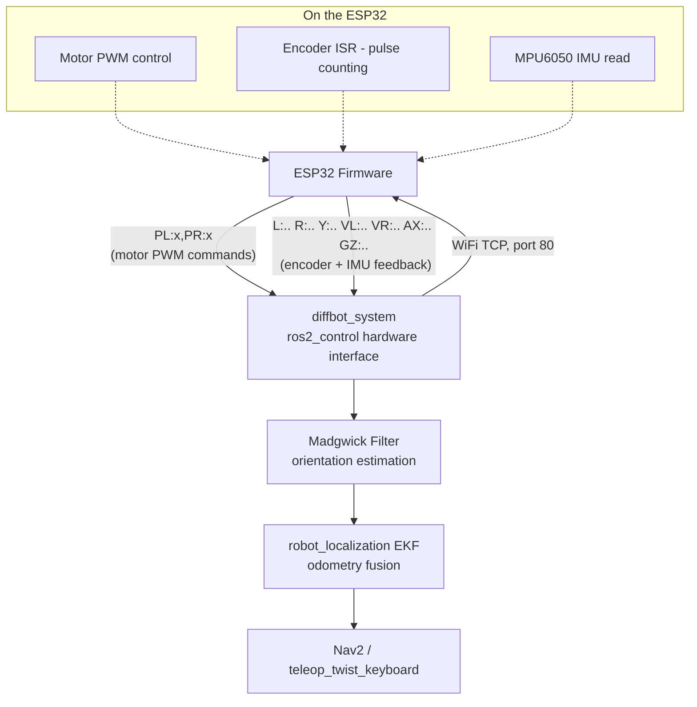

# DiffBot ROS 2 Control — ESP32-Based Differential Drive Hardware Interface

A `ros2_control` hardware interface and companion ESP32 firmware for a low-cost differential-drive robot, built as a budget-conscious alternative to Raspberry Pi–based mobile robot platforms — designed to work with standard ROS 2 Nav2 stacks and `teleop_keyboard` out of the box.

---

## Problem

Most ROS 2 mobile robot tutorials and reference platforms (TurtleBot, standard diff-drive kits) assume a Raspberry Pi as the onboard compute running micro-ROS or a serial bridge. In practice, that assumption breaks down:

- **Raspberry Pi units are expensive relative to a student/hobbyist robotics budget**, and prices have only gotten worse with ongoing supply shortages.
- **Availability is inconsistent** — in many regions, sourcing a Pi (or paying inflated reseller prices for one) is a real barrier to just getting a robot moving, long before any of the interesting SLAM/navigation work begins.
- Many existing `ros2_control` hardware interface examples assume either a Pi-class SBC or expensive, purpose-built motor controller boards.

## Solution

This project replaces the Raspberry Pi with a **~$5-8 ESP32** as the motor/sensor microcontroller, communicating with the ROS 2 host machine over **WiFi (TCP socket)**, paired with low-cost, widely available components:

- **ESP32** — WiFi-capable, dual-core, cheap, and available almost everywhere, unlike Pi boards
- **2× BTS7960 motor drivers** — inexpensive high-current H-bridge modules, sold everywhere for a few dollars each
- **2× disc/slot-based wheel encoders** — basic optical interrupters, not expensive quadrature modules
- **MPU6050 IMU** — a few-dollar 6-axis accelerometer/gyroscope, sufficient for yaw estimation via Madgwick + EKF fusion

The result is a `ros2_control` hardware interface that talks to this ESP32 over the local network, exposing standard ROS 2 velocity control and odometry feedback — fully compatible with `teleop_keyboard`, Nav2, and any other `ros2_control`-based navigation stack, at a fraction of the typical hardware cost.

---

## Hardware Overview

| Component | Role | Approx. Cost |
|---|---|---|
| Chassis (full) | Frame, wheels, caster mount | ₨1,000 |
| ESP32 Dev Board | Motor/sensor microcontroller, WiFi bridge to ROS 2 | ~$5-8 |
| 2× BTS7960 | H-bridge motor drivers (one per wheel) | ~$5 each |
| 2× Disc encoders | Wheel odometry (interrupt-driven pulse counting) | ~$1-2 each |
| MPU6050 | IMU — accelerometer + gyroscope for yaw/orientation | ~$2-3 |
| 5× Battery cells | Split across motor supply + isolated ESP32 logic supply | ₨320 each |
| 2× DC gear motors | Rear-wheel drive | — |
| 1× Front caster wheel | Passive support, non-driven | — |

*Costs are regional (Pakistan sourcing) and approximate — intended to illustrate the scale of savings versus a Raspberry Pi–based build, not as a precise BOM quote.*

**Drivetrain layout:** differential drive, 2 driven rear wheels + 1 passive front caster.

### Pinout (ESP32)

| Function | Pin |
|---|---|
| Left motor — REN / LEN | 26 / 25 |
| Left motor — RPWM / LPWM | 33 / 32 |
| Right motor — REN / LEN | 13 / 12 |
| Right motor — RPWM / LPWM | 14 / 27 |
| Left encoder | 4 |
| Right encoder | 15 |
| I2C SDA / SCL (MPU6050) | 22 / 23 |

### Physical parameters (firmware constants)

- Wheel radius: `0.033 m`
- Encoder slots per revolution: `20`

---

## System Architecture



**Wire protocol (ESP32 ↔ ROS 2 host, plain text over TCP):**

- **Commands (host → ESP32):**
  - `PL:<int>,PR:<int>` — left/right PWM, clamped to [-255, 255]
  - `S` — stop both motors
  - `Z` — reset encoder counts
- **Feedback (ESP32 → host), sent continuously:**
  - `L:<count>,R:<count>,Y:<yaw>,VL:<vel>,VR:<vel>,AX:..,AY:..,AZ:..,GX:..,GY:..,GZ:..`

---

## Repository Structure

```
diffbot-ros2-control/
├── README.md
├── LICENSE
├── firmware/
│   ├── diffbot_esp32_controller.ino
│   └── config.h.example          # WiFi credentials template — copy to config.h
├── diff/                          # this package — the ros2_control hardware interface
│   ├── src/
│   │   └── diffbot_system.cpp     # WiFi TCP client, implements the hardware interface
│   ├── include/
│   │   └── diff/
│   │       └── diffbot_system.hpp
│   ├── config/
│   │   ├── controllers.yaml
│   │   ├── ekf.yaml
│   │   └── madgwick.yaml
│   ├── launch/
│   │   └── control.launch.py
│   ├── urdf/
│   │   └── mws_control.urdf
│   ├── rviz/
│   │   └── mws.rviz
│   ├── worlds/
│   │   └── depot.sdf              # Gazebo simulation world (optional)
│   ├── meshes/                     # Robot visual/collision meshes (SolidWorks export)
│   ├── diffbot_system_plugin.xml
│   ├── CMakeLists.txt
│   └── package.xml
├── transport_drivers/              # vendored dependency — see Dependencies below
├── serial/                          # vendored dependency — see Dependencies below
└── serial_ros/                      # vendored dependency — see Dependencies below
```

---

## Dependencies

This repo vendors the following third-party packages directly under their own folders (rather than requiring a separate install step), so the workspace builds as-is with `colcon build`:

- [`ros-drivers/transport_drivers`](https://github.com/ros-drivers/transport_drivers) — serial/UDP transport utilities
- [`wjwwood/serial`](https://github.com/wjwwood/serial) — cross-platform C++ serial library
- [`serial_ros`](https://github.com/RoverRobotics-forks/serial-ros2) — ROS 2 wrapper around the above *(confirm this matches the fork you actually used)*

These are included with their original licenses intact and are not modified — they're used as-is by the `diff` package for the serial/transport layer. All credit for these packages belongs to their original authors.

Additional standard ROS 2 dependencies (installed via your normal ROS 2 setup, not vendored): `ros2_control`, `ros2_controllers`, `robot_localization` (EKF), `imu_filter_madgwick`.

---

## Setup

### 1. Configure and flash the ESP32 firmware

```bash
cd firmware/
cp config.h.example config.h
```

Edit `config.h`:
```cpp
constexpr const char* WIFI_SSID = "your-network-name";
constexpr const char* WIFI_PASSWORD = "your-network-password";
```

Flash `diffbot_esp32_controller.ino` via the Arduino IDE (or `arduino-cli`). Open the Serial Monitor at `115200` baud after flashing — the ESP32 will print its assigned IP address once connected to WiFi. Note this IP down.

### 2. Configure the ROS 2 hardware interface

In `src/diffbot_system.cpp` (or wherever `esp32_ip_` is declared), set the IP address you noted above:

```cpp
std::string esp32_ip_{"192.168.x.x"};  // ESP32's IP from Serial Monitor
int esp32_port_{80};
```

### 3. Build

```bash
colcon build --packages-select diff
source install/setup.bash
```

### 4. Launch

```bash
ros2 launch diff control.launch.py use_sim_time:=false use_ekf:=true use_rviz:=true
```

- `use_sim_time:=false` — run on real hardware (set `true` only if running against `worlds/depot.sdf` in Gazebo)
- `use_ekf:=true` — enable `robot_localization` EKF fusion of wheel odometry + Madgwick-filtered IMU
- `use_rviz:=true` — launch RViz with the provided `mws.rviz` config

### 5. Drive it

```bash
ros2 run teleop_twist_keyboard teleop_twist_keyboard
```

Or bring up Nav2 pointed at this hardware interface for autonomous navigation.

---

## Known Limitations

- Encoder counting is single-edge (`FALLING`) per channel, not true quadrature — direction is inferred from commanded PWM sign (`motor_dir`) rather than sensed from the encoder signal itself. This is a reasonable simplification for a cost-constrained build but means odometry direction relies on the motor driver state, not independent encoder confirmation.
- WiFi TCP introduces variable latency compared to a wired serial link — acceptable for this platform's target speeds, but worth knowing if adapting this design for a faster robot.
- No wheel slip detection; odometry is purely encoder + IMU fused via EKF, with the usual drift characteristics of that approach over long runs without loop closure (handled at the SLAM layer, not here).

---

## Related Work

This hardware interface is the drivetrain foundation for a full [depth-estimation + RTAB-Map SLAM + Nav2 pipeline](#) *(link to your main repo)*, where this robot carries a monocular depth camera fine-tuned for real-time obstacle mapping in a specific deployment environment.

---

## License

See `LICENSE`.
